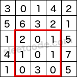

# Range Sum Query 2D - Mutable

Given a 2D matrix matrix, find the sum of the elements inside the rectangle defined by its upper left corner (row1, col1) and lower right corner (row2, col2).



The above rectangle (with the red border) is defined by (row1, col1) = (2, 1) and (row2, col2) = (4, 3), which contains sum = 8.

**Example:**
```
Given matrix = [
  [3, 0, 1, 4, 2],
  [5, 6, 3, 2, 1],
  [1, 2, 0, 1, 5],
  [4, 1, 0, 1, 7],
  [1, 0, 3, 0, 5]
]

sumRegion(2, 1, 4, 3) -> 8
update(3, 2, 2)
sumRegion(2, 1, 4, 3) -> 10
```

**Solution:**
```java
public class NumMatrix {

  int m, n;
  int[][] arr;    // stores matrix[][]
  int[][] BITree; // 2-D binary indexed tree

  public NumMatrix(int[][] matrix) {
    if (matrix.length == 0 || matrix[0].length == 0) {
        return;
    }

    m = matrix.length;
    n = matrix[0].length;

    arr = new int[m][n];
    BITree = new int[m + 1][n + 1];

    for (int i = 0; i < m; i++) {
      for (int j = 0; j < n; j++) {
        update(i, j, matrix[i][j]); // init BITree[][]
        arr[i][j] = matrix[i][j];   // init arr[][]
      }
    }
  }

  public void update(int i, int j, int val) {
    int diff = val - arr[i][j];
    arr[i][j] = val;

    i++; j++;
    while (i <= m) {
      int k = j;
      while (k <= n) {
        BITree[i][k] += diff;
        k += k & (-k);
      }
      i += i & (-i);
    }
  }

  int getSum(int i, int j) {
    int sum = 0;

    i++; j++;
    while (i > 0) {
      int k = j;
      while (k > 0) {
        sum += BITree[i][k];
        k -= k & (-k);
      }
      i -= i & (-i);
    }
    return sum;
  }

  public int sumRegion(int i1, int j1, int i2, int j2) {
    return getSum(i2, j2) - getSum(i1-1, j2) - getSum(i2, j1-1) + getSum(i1-1, j1-1);
  }
}


// Your NumMatrix object will be instantiated and called as such:
// NumMatrix numMatrix = new NumMatrix(matrix);
// numMatrix.sumRegion(0, 1, 2, 3);
// numMatrix.update(1, 1, 10);
// numMatrix.sumRegion(1, 2, 3, 4);
```